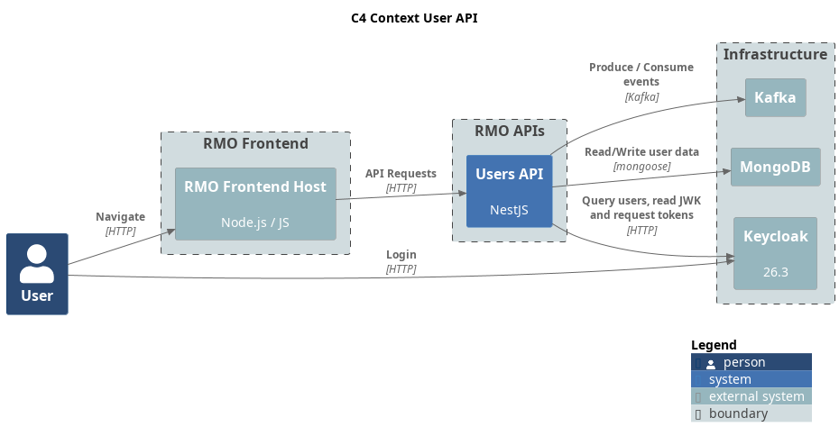

= Rolemaster Unified Users API

API for user management to set user preferences such as language, drive system.
It also includes the friendship management model needed to create games.

This project is part of RMU Online: https://github.com/labcabrera/rmu-platform

WARNING: *This application is an independent project developed by fans of Rolemaster Unified. It is not affiliated with, endorsed by, or licensed by Iron Crown Enterprises (ICE), the owners of the Rolemaster intellectual property.*
*All Rolemaster trademarks, game systems, and materials are the property of Iron Crown Enterprises. This software is provided for personal, non-commercial use only. If you enjoy Rolemaster, please support the official publications and content from ICE.*

== Description

